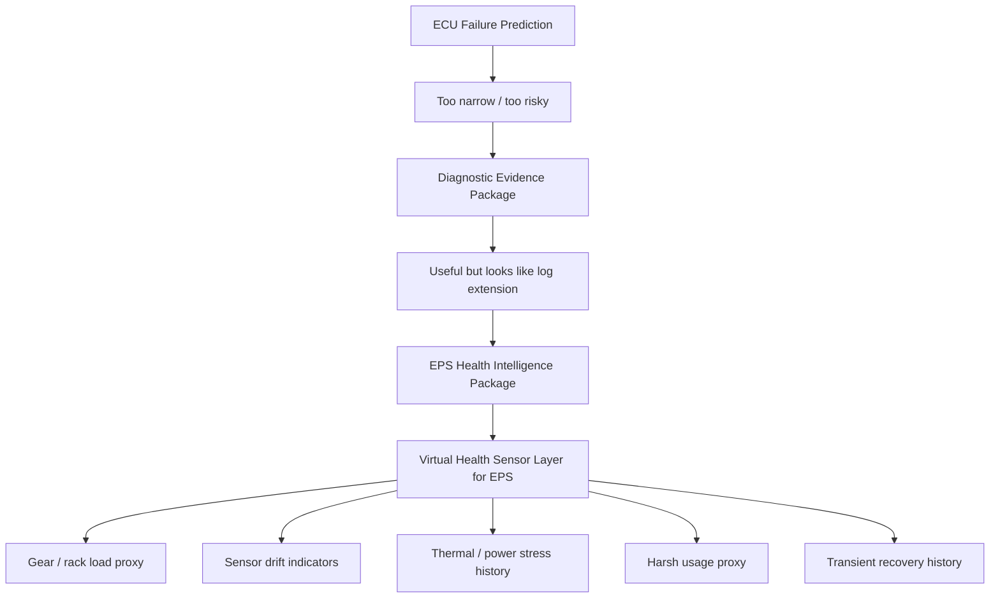

# 11. Virtual Health Sensor Market Framing

## Purpose

This note captures the latest market framing for `EPS Health Intelligence Package`.

The key shift is to describe the package not as “more logs” or “failure prediction,” but as a **virtual health sensor layer for EPS systems**.

> EPS internal signals are used to construct proxy health indicators for gear / rack load, mechanical stress, sensor drift, thermal stress, power stress, and transient abnormal recovery.

## Core Framing

### Old weak framing

```text
We can provide more EPS logs.
We can provide data that may be useful for AI models.
```

This sounds like a data output feature and does not clearly explain why the customer should pay.

### Better framing

```text
We provide a virtual health sensor layer for EPS systems.
```

This means:

- no additional physical sensor is required initially
- existing EPS ECU signals are used
- the output is not raw logs, but interpretable health / stress / degradation indicators
- the package helps EPS system / gear suppliers position their product as a health-aware subsystem

## Adjacent Market Pattern: Virtual Sensors from Existing Signals

A useful adjacent market pattern is the automotive virtual sensor business.

The relevant pattern is:

```text
existing vehicle signals
  -> software-defined estimation logic
  -> new sensor-like output
  -> additional customer value without extra hardware
```

Examples in the wider market include virtual signals for:

- tire pressure
- tire wear
- road friction
- road condition
- vehicle / chassis state

The exact EPS health package may not be visible as an established product category yet, but the business pattern of **extracting new value from existing signals** already exists.

## EPS Version of the Pattern

For EPS, the equivalent hypothesis is:

```text
existing EPS signals
  -> virtual health sensor layer
  -> EPS health indicators
  -> supplier / OEM diagnostic and prognostic value
```

Candidate existing EPS signals:

- motor current
- target current
- steering torque
- steering angle
- steering angle speed
- vehicle speed
- ECU temperature
- motor temperature
- power voltage
- assist limitation state
- control mode
- DTC / warning state

Candidate virtual health outputs:

- assist current baseline deviation
- steering torque to motor current ratio
- current tracking warning count
- torque sensor redundancy delta
- thermal derating accumulation
- low voltage stress history
- high-load low-speed event count
- end-stop / curb-hit-like event count
- transient abnormal recovery count

## Why this helps the gear supplier value hypothesis

The current target hypothesis is not “sell VHM directly to the OEM.”

The immediate question is:

> Can an EPS ECU / control supplier help a gear or EPS system supplier explain gear / rack load history, harsh usage, and return-part behavior using ECU-side signals?

The virtual health sensor framing helps because it avoids overclaiming.

It does not say:

- gear wear is directly detected
- rack degradation is predicted
- individual vehicle RUL is known
- supplier can monitor the OEM fleet alone

Instead, it says:

- gear / rack load proxy can be estimated
- harsh usage proxy can be accumulated
- stress history can be preserved
- return-part analysis can be supported
- future prognostic models can be made more feasible

## Product Definition

`EPS Health Intelligence Package` can be defined as:

> A virtual health sensor layer that converts existing EPS ECU signals into interpretable health indicators, stress histories, and prognostic data materials for EPS system / gear suppliers and future OEM vehicle health programs.

Short version:

> EPS Health Intelligence Package = virtual health sensor layer for EPS.

## Relationship to existing repo concepts



## Technical Evidence Signals to Continue Researching

The next research should not search only for “EPS Health Intelligence,” because that exact wording may not exist.

Search around these technical clusters instead.

### 1. Automotive virtual sensors

Search terms:

```text
automotive virtual sensor existing sensors
software-defined sensor automotive
vehicle virtual sensor no additional hardware
sensor fusion virtual sensor vehicle
```

Purpose:

- validate that “existing signals -> new virtual output” is an accepted product / technology pattern

### 2. EPS friction / rack force / disturbance estimation

Search terms:

```text
electric power steering friction estimation
rack force estimation EPS
steering torque motor current friction estimation
steering system disturbance observer motor measurements
```

Purpose:

- validate that hidden steering load / friction / disturbance can be estimated from available signals

### 3. Harsh usage and mechanical stress proxies

Search terms:

```text
steering end stop event detection electric power steering
curb hit detection steering torque motor current
parking steering high load low speed EPS durability
```

Purpose:

- validate gear-supplier-facing value around usage severity and stress accumulation

### 4. Actuator / motor condition monitoring

Search terms:

```text
electric actuator condition monitoring automotive
motor current signature analysis actuator degradation
automotive actuator prognostics health management
```

Purpose:

- use adjacent motor / actuator prognostics to support EPS health indicator design

## Current Market Read

| Question | Current read |
|---|---|
| Is there a visible “EPS health intelligence” product category? | Not clearly visible yet |
| Is the virtual sensor business pattern established? | Yes, adjacent examples exist |
| Is EPS hidden-state estimation technically plausible? | Yes, research signals exist |
| Is gear supplier pain directly proven? | Not yet; requires interviews / domain validation |
| Is “virtual health sensor layer for EPS” a useful framing? | Yes, stronger than “more logs” |

## Open Validation Questions

### For gear / EPS system suppliers

- Do return-part investigations lack usage / stress history?
- Would gear / rack load proxy help warranty analysis?
- Would harsh usage history help explain field returns?
- Would a health-ready EPS help OEM-facing differentiation?
- Which outputs are useful: raw indicator, summary state, or suspected cause category?

### For ECU / control suppliers

- Which candidate signals are already available?
- Which indicators can be calculated with low CPU / NVM impact?
- Which indicators can be stored without increasing safety liability?
- Which indicators can be validated using HILS / bench / durability tests?

### For OEM gatekeepers

- Would EPS subsystem health signals be accepted as internal diagnostic / VHM materials?
- Which readout channels are realistic: service diagnostics, remote diagnostics, OTA, return-part extraction?
- What data ownership, security, and false-positive constraints matter most?

## Recommended Next Step

Create the following data file next:

```text
data/gear_load_virtual_sensor_hypothesis.tsv
```

Suggested columns:

```text
hypothesis_id
hidden_state
candidate_proxy
required_signals
normalization_factors
false_positive_factors
validation_method
gear_supplier_value
oem_value
initial_confidence
```

Example row:

```text
GLV001	gear_friction_or_rack_load_increase	assist_current_baseline_deviation	motor_current,steering_torque,vehicle_speed,steering_angle_speed	temperature,tire,road,alignment,load,assist_mode	tire_pressure_low,rough_road,heavy_load	bench friction injection / durability log	return-part load history and design feedback	future VHM subsystem signal	medium
```

## Summary

The market has not clearly exposed a direct “EPS gear health intelligence” product category.

However, the adjacent pattern is strong:

> existing signals + software estimation = new virtual sensor value

The proposed EPS version is:

> existing EPS ECU signals + health indicator logic = virtual health sensor layer for EPS

This framing supports the current business hypothesis better than “more logs” or “AI failure prediction.”
