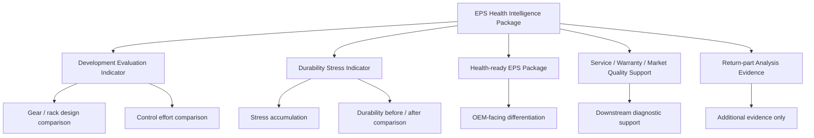

# 12. Reset Hypothesis: Development Evaluation First

## Why this reset is needed

Previous discussion leaned too much toward **return-part analysis** and **warranty analysis**.

That direction is not wrong, but it is too downstream for the current development / supplier viewpoint.

From a development perspective, return-part analysis is a secondary or tertiary use case:

```text
field issue occurs
  -> part is returned
  -> analysis starts
  -> evidence may help
```

The current project should start earlier:

```text
development / evaluation
  -> gear / rack / mechanical load behavior is compared
  -> EPS control effort / stress / margin indicators are defined
  -> the same indicators can later be reused in durability, diagnostics, service, and market analysis
```

## Current corrected hypothesis

The primary hypothesis is no longer:

> Return-part analysis lacks market usage history.

The revised hypothesis is:

> EPS ECU signals can provide common development and evaluation indicators for gear / rack design, mechanical load, control effort, stress accumulation, and margin changes.

In short:

> Use ECU-side signals to make EPS mechanical behavior more observable during development and evaluation.

## Primary value target

The first value target remains:

> EPS system / gear supplier

But the initial value is reframed.

### Less suitable first value

```text
Support return-part analysis after field problems occur.
```

### Better first value

```text
Support development, bench evaluation, durability evaluation, and gear / rack design comparison using ECU-signal-based indicators.
```

## Why this is more natural

For development teams, it is more natural to ask:

- Can gear design A/B be compared through EPS control effort?
- Does rack friction increase show up in motor current / torque relationship?
- Does durability aging change the required assist current under comparable steering conditions?
- Can high-load low-speed steering stress be accumulated as a test metric?
- Can thermal / voltage / current tracking stress be evaluated with the same indicator set?

This is more useful earlier than waiting for market returns.

## New value hierarchy

```text
L1: Development Evaluation Indicator
  Gear / rack / mechanical load behavior is evaluated through ECU signals.

L2: Durability Stress Indicator
  Durability, bench, and HILS tests accumulate stress and control-effort changes.

L3: Health-ready EPS Package
  Production EPS carries the same indicator concepts as diagnostic / health data.

L4: Service / Warranty / Market Quality Support
  The indicators support downstream diagnostics and quality analysis.

L5: Return-part Analysis Evidence
  Returned parts may use stored evidence as an additional analysis source.
```

Return-part analysis is still useful, but it should not be the main story.

## What becomes the main story?

The main story becomes:

> EPS gear / rack design and durability evaluation can be supported by ECU-signal-based health / stress / control-effort indicators.

This is still compatible with the existing `EPS Health Intelligence Package` concept, but it changes the initial proof point.

## Key technical idea

The important observable is not always performance degradation itself.

EPS control may hide mechanical degradation from the driver by increasing assist effort.

Therefore the useful indicator may be:

> increasing control effort required to maintain comparable steering performance.

Candidate expressions:

- control effort under comparable steering conditions
- assist current baseline deviation
- steering torque to motor current relationship
- current tracking warning count
- thermal derating accumulation
- high-load low-speed event count
- end-stop / curb-hit-like event count
- transient abnormal recovery count

## Development-facing use cases

### 1. Gear / rack design A/B comparison

Compare designs using common ECU-side indicators.

Questions:

- Which design needs less assist current under comparable conditions?
- Which design accumulates less thermal stress?
- Which design shows less current tracking stress?
- Which design has better margin under high-load low-speed operation?

### 2. Durability test monitoring

Use health / stress indicators before and after durability tests.

Questions:

- Did required control effort increase after durability aging?
- Did sensor drift or redundancy delta increase?
- Did thermal derating events increase?
- Did transient abnormal recovery events increase?

### 3. Bench / HILS / fault-injection validation

Validate candidate indicators with controlled conditions.

Examples:

- Inject increased friction
- Add load
- Lower voltage
- Raise temperature
- Add sensor offset
- Degrade current tracking response

Expected result:

- Candidate indicators should respond in interpretable directions.

### 4. OEM-facing development value

Position the EPS as:

> A health-ready EPS whose mechanical load, stress, and control-effort indicators can be evaluated during development and reused in diagnostics / VHM later.

## What to avoid

Avoid leading with:

- return-part analysis
- warranty analysis
- field failure prediction
- individual RUL
- user notification
- fleet monitoring

These are downstream or future uses.

## Revised pitch

### Short pitch

> EPSのギア / ラック設計・耐久評価・OEM提案に使える、ECU信号ベースのhealth / stress / control effort indicatorを定義する。

### English pitch

> Define ECU-signal-based health, stress, and control-effort indicators that help evaluate EPS gear / rack design, durability behavior, and future health-ready EPS differentiation.

## Relationship to previous concepts



## Current validation question

The next question should be:

> Would gear / EPS system development teams value ECU-signal-based indicators that compare mechanical load, control effort, and stress across gear / rack designs and durability conditions?

This is more appropriate than asking first about return-part analysis.

## Next files to create

Suggested next data file:

```text
data/development_evaluation_indicator_hypothesis.tsv
```

Suggested columns:

```text
hypothesis_id
use_case
mechanical_or_control_question
candidate_indicator
required_signals
normalization_factors
validation_setup
expected_indicator_change
value_for_gear_supplier
confidence
```

Example row:

```text
DEV001	gear_design_ab_comparison	Does design B require less assist effort under comparable steering conditions?	assist_current_baseline_deviation	motor_current,steering_torque,vehicle_speed,steering_angle_speed	temperature,tire,road,assist_mode	bench A/B comparison	lower normalized assist current is better	compare gear/rack design efficiency	medium
```

## Summary

This reset changes the initial proof point.

From:

> Downstream return-part evidence.

To:

> Development and durability evaluation indicators for gear / rack / mechanical load behavior.

Return-part and warranty analysis remain valid downstream use cases, but they should not define the initial value proposition.
